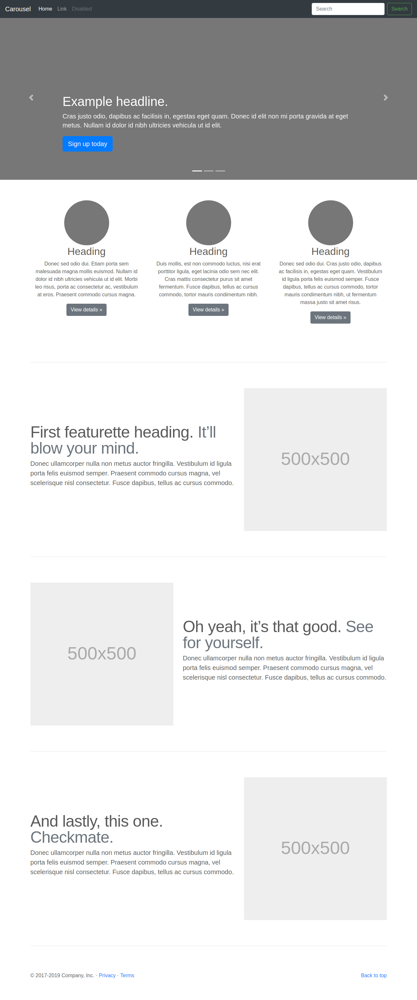

# BOOTSTRAP - exercise 2
https://wendyquarteer.github.io/BOOTSTRAP/

## Learning objectives
- Learn to install and work with Bootstrap
- Learning to use the Grid component from Bootstrap
- Learn how to add JavaScript components.
- Learn how easy bootstrap will make you life.

### The Mission
Implement the layout at the bottom as good as possible, you can search 
for your own images to use in the layout. Make sure you have a working 
carousel using the bootstrap component when you click on the arrows of 
the top. Publish your result.
Not having the exact layout is not the worst, a carousel is a must have 
though! We recommend you start from top to bottom recreating this.

###Layout

